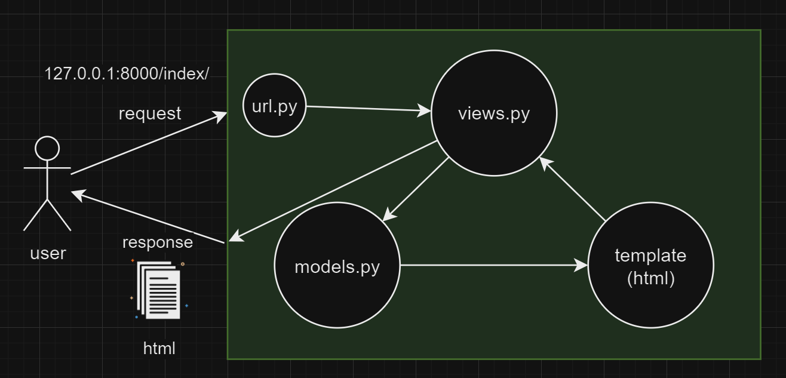

## Django
*django : 웹앱 구축을 위한 파이썬 베이스 프레임워크

1. 프로젝트 생성 
```bash
django-admin startproject {프로젝트명}
```

2. 가상환경 생성
```bash
python -m venv venv
```

3. 가상환경 활성화
```bash
source venv/Scripts/activate
```

4. 가상환경 내에서 django 설치
```bash
pip install django
```

5. 서버 실행
```bash
python manage.py runserver
```

6. 앱 생성
```bash
django-admin startapp {앱 이름}
```

<b>7. 앱 등록 : 프로젝트 파일 내 setting.py에서 생성하고자 하는 앱파일을 'INSTALLED_APPS'에 추가</b>
```bash
# Application definition

INSTALLED_APPS = [
    'django.contrib.admin',
    'django.contrib.auth',
    'django.contrib.contenttypes',
    'django.contrib.sessions',
    'django.contrib.messages',
    'django.contrib.staticfiles',
    'second_app'
]
```
## MTV 구조


핵심 파일들
- urls.py : 추가하고 싶은 앱 경로 추가 
    ```python
    urlpatterns = [
        path('admin/', admin.site.urls),
        path('',views.index),
        path('post',views.post),
    ]
    ```
- views.py : 앱 내에서 실행하고 싶은 함수 정의
    - 함수의 인자에 항상 'request'가 들어간다.
    - 두 번째 인자는 랜딩하고 싶은 html 페이지

    ```python
    from django.shortcuts import render
    from faker import Faker
    import random

    # Create your views here.
    def post(request):
        fake = Faker()
        fake_posts = []

        for post in range(100):
            fake_posts.append(fake.text())

        context={
            'fake_posts':fake_posts
        }

        return render(request,'post.html',context)
        ```
- .html : 랜딩되는 html 페이지
    ```html
    <!DOCTYPE html>
    <html lang="en">
    <head>
        <meta charset="UTF-8">
        <meta name="viewport" content="width=device-width, initial-scale=1.0">
        <title>Post</title>
    </head>
    <body>
        <h1>post</h1>
        
        <div>{{post}}</div>
        
        <h4><a href="/">뒤로 가기</a></h4>
    </body>
    </html>
    ```
        - django 내에서 반복문 사용 -> 